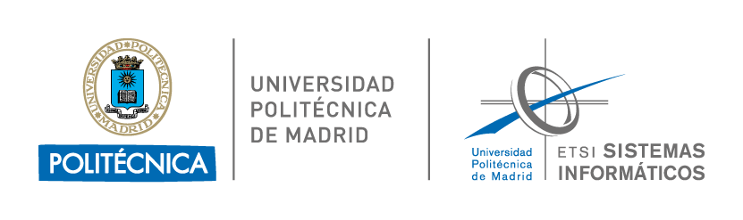

  
 
<h1 align="center">Graph Neural Networks - Master in Deep Learning of UPM</h1> 

 Welcome to the official repository for the <strong>Graph Neural Networks</strong> subject of the <a href="https://masterdeeplearning.etsisi.upm.es/">Master in Deep Learning</a> at the Universidad Politécnica de Madrid (UPM). 
 
 
<strong>Coordinator:</strong> Ángel Panizo LLedot   
<strong>Teachers:</strong> Ángel Panizo LLedot & Adrián Girón Jiménez 

## 📖 Course Content

- 📘 Session 1: [Introducción a Grafos](sessions/session_1/)
- 📘 Session 2: [Shallow Encoders](sessions/session_2/)
- 📘 Session 3: [Introducción a las GNNs](sessions/session_3/)
- 📘 Session 4: [GNNs avanzadas](sessions/session_4/)
- 📘 Session 5: [Consideraciones prácticas](sessions/session_5/)
- 📘 Session 6: [Métodos Generativos para GNNs](sessions/session_6/)

## 📅 Schedule
Refer to the [schedule](https://masterdeeplearning.etsisi.upm.es/wp-content/uploads/2024/06/Horario-Master-Deep-Learning-UPM_v2.pdf) to check timings and plan your sessions.

